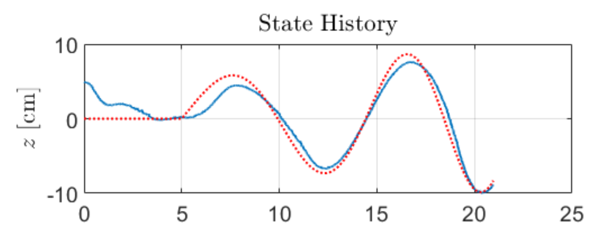
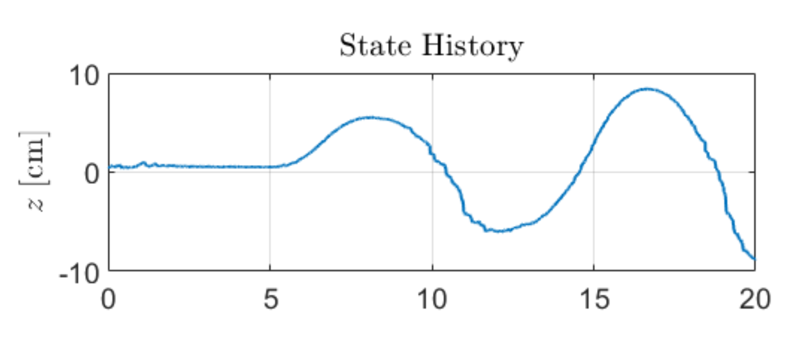
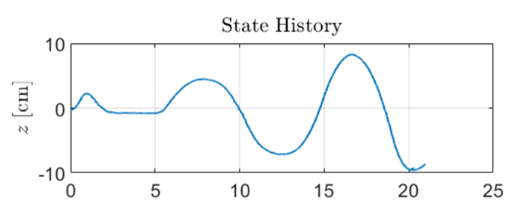
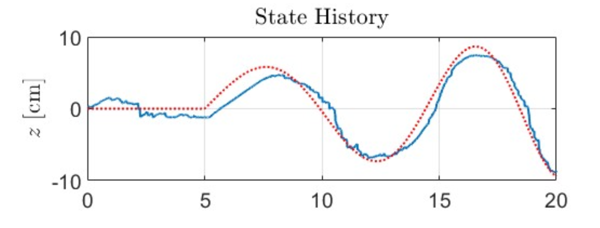
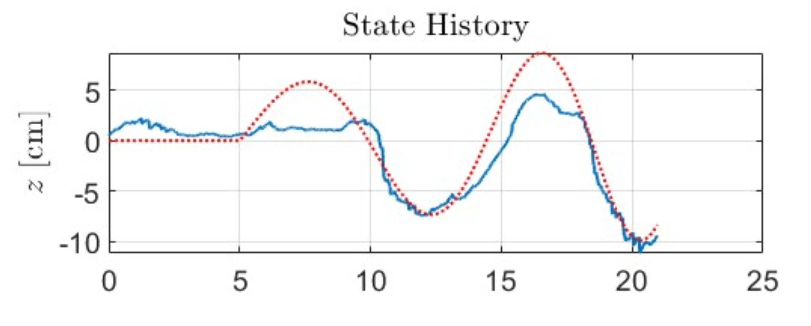
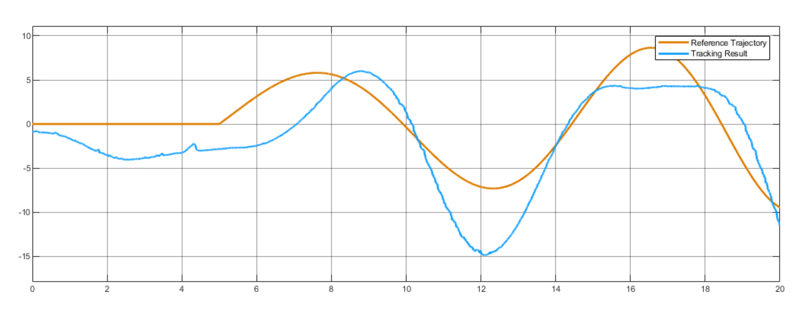
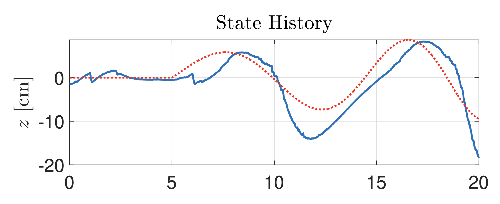

# EE222-Nonlinear-Systems-Project-Ball-and-Beam
Reports, videos and leaderboard of different controllers on EE 222 Ball and Beam nonlinear control project Spring 2025. The original repo with project instructions can be found [here](https://github.com/YasinSonmez/EE222-Nonlinear-Systems-Ball-and-Beam-Project).

| Group | Controller Description | Result | Video | Score |
|-------|-------------------------|--------|--------|-------|
| 3 | [EKF + PID-LQR](./3/3.pdf) |  |  | 1.36 |
| 5 | [LO + LQR](./5/5.pdf) |  |  | 1.59 |
| 6 | [EKF + FL-LQR](./6/6.pdf) |  |  | 1.63 |
| 2 | [EKF + LQR](./2/2.pdf) |  |  | 2.64 |
| 4 | [EKF + FL-LQR](./4/4.pdf) |  |  | 2.87 |
| 1 | [PID](./1/1.pdf) |  |  | 4.42 |
| 7 | [EKF + LQR](./7/7.pdf) |  |  | 4.62 |
